# ext-iv-ice

## What is this?
This is an extension for the ImageViewer application to allow semantic tagging of images, and searches
based on those tags. Originally a standalone application called ICE (Image Classification Engine) from 2012, this
extension duplicates some of the functionality of the original application in the form of an extension
for ImageViewer.

## How does it work?
When the ICE extension is first installed, the ImageViewer interface at first glance looks pretty much the
same as it did before:

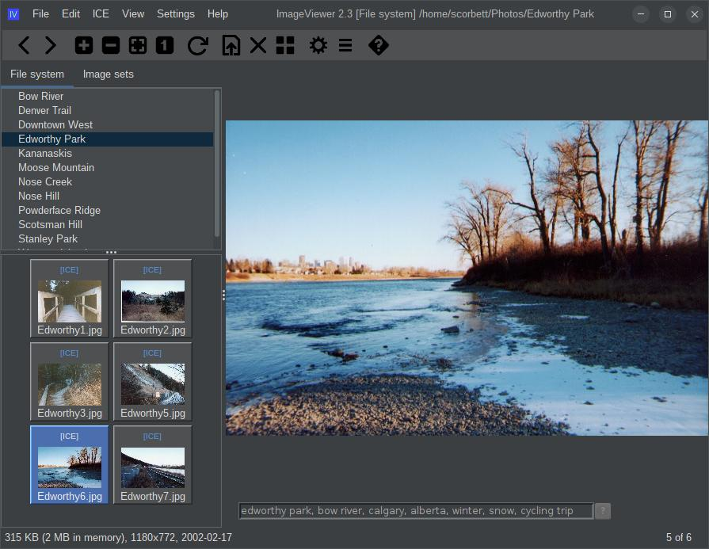

But there are actually quite a few additional features now available in the application! Let's take a look.

### Tagging a single image

The first thing we can do is hit Ctrl+G (or whatever shortcut you have configured in the application settings dialog)
to bring up the tag edit dialog for the currently selected image:

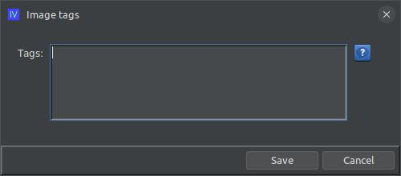

This allows us to enter "tags", or very short text descriptions, that can describe or label the contents of
this image. For example, we could enter information about when and where the photo was taken, who is in it,
what scenery is present, what the weather was like, or whatever else we like. Tags are entered as a comma-separated
list and you can be as generic or as specific as you like:

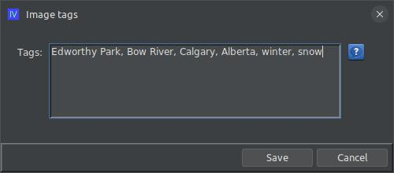

When we hit enter or click the "Save" button on the tag edit dialog, we will notice that a read-only summary
of the tags we entered is displayed at the bottom of the main image panel:

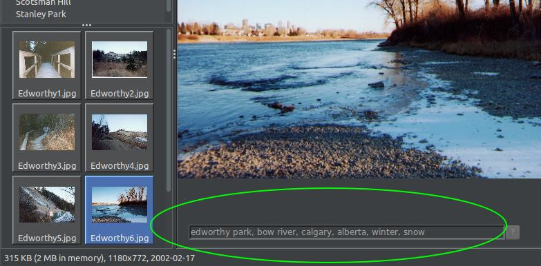

We can hit Ctrl+G again to bring the dialog back up and make any changes.

Tagging images is a tedious and time-consuming process, but it will be worth it later! And, as it turns out,
there's a way to speed up the process considerably...

### Tagging multiple images at once

In the ICE menu, we will find the "Tag images" menu entry:

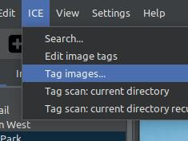

Selecting this will bring up the "Tag images" dialog:

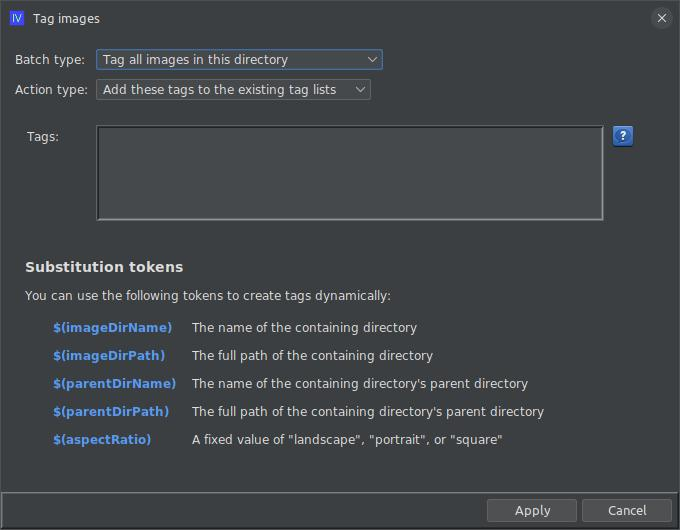

Here, we can apply tags to an entire directory of photos at a time, with optional recursion for subdirectories.
If there are tags that a set of photos all have in common (for example, location, or the date they were taken),
you don't need to tag each image individually. 

On this dialog we also have the option of using "special" tags that will be substituted with some value
dynamically. This can be very useful! For example, if the directory that contains the photos to be tagged is named
after the location where the photos were taken, then we can use the special tag `$(imageDirName)`, and this
will be replaced with the directory name.

For our example, every photo in this directory was taken in Edworthy Park, and in fact, the directory that
contains them is named Edworthy Park, so we can make use of this tag:

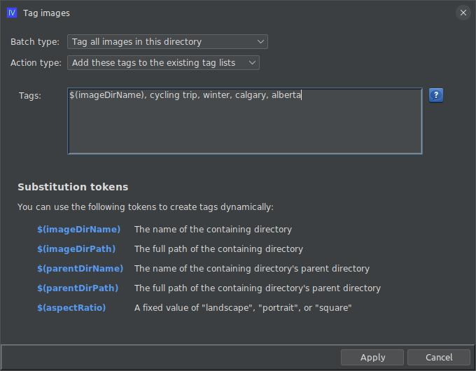

When we hit the "Apply" button, the tags we've entered here are applied to all images in the current directory
(with optional recursion into subdirectories if selected). Our special tag `$(imageDirName)` is automatically
replaced with the name of the containing directory. When we're finished, we can pick any image in this directory
and press Ctrl+G to view the tags that were applied to it:

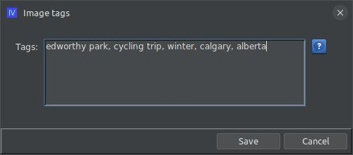

### Quick-tagging

There's another option to help you quickly tag images. You can assign up to 8 hotkeys to quickly apply
either a single tag to the current image, or a set of tags. You can find this option in the properties
dialog, under `ICE - General`. It looks like this:

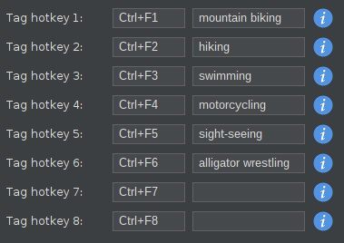

Any entry with a blank tag list is ignored. In the screenshot above, you can see that `Ctrl+F1` through `Ctrl+F6`
are used for frequently-used tags, while `Ctrl+F7` and `Ctrl+F8` are not currently used. Hit the hotkey
when viewing any image to apply the corresponding tags. If the given tags are already present for the image,
they will not be duplicated.

### Experimental! Auto-tagging with an LLM

**New in 3.3.0!** - if you have access to any OpenAI-compatible LLM, you can use the new "Auto-tag" feature
to get the LLM to generate tags for you based on the image content. This is an experimental feature
and is subject to change! To get started, you'll need to configure your LLM connection details. You
can do this in the properties dialog, in the `Auto-tag` section. It looks like this:

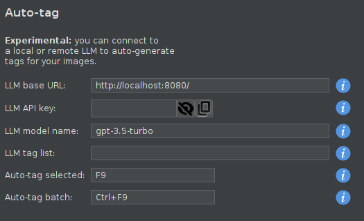

The following configuration can be specified:

- **LLM base URL** - the base URL of your LLM API endpoint. This is just the server with optional port. For example:
  `http://localhost:8080` or `https://my-llm-provider.com`. Don't enter the path information (`v1/chat/completions` for
  example).
- **LLM API key** - if your LLM provider requires an API key, you can enter it here. If not required, leave blank.
- **LLM model name** - the name of the model to use for auto-tagging. Not all servers require this value.
- **LLM tag list** - an optional list of tags that the LLM will be constrained to choose from. You can leave this blank
  to allow the LLM to decide on its own tags, but be aware that the results may be unpredictable and inconsistent from
  image to image. The recommended approach is to supply a well-chosen tag list that is relevant to your images. For
  example, for a mountain biking photo collection:
  `daytime, nighttime, sunny, rainy, winter, summer, mountains, forest, river`, and so on.
- **Auto-tag selected** - choose the hotkey that will trigger auto-tag for the currently selected image. Default 'F9'.
- **Auto-tag batch** - choose the hotkey that will trigger auto-tag for all images in the current directory (with
  optional recursion). Default 'Ctrl+F9'.

Note that auto-tagging is currently only supported for PNG and JPEG images. Your LLM server may have an upper
limit on file size and/or number of allowed requests. Be particularly careful with the "batch" option, as the number of
requests may be quite large!

### Searching for images

Okay, so you've gone through your photos and tagged each one with painstaking detail. Now what? Now we can
visit the search dialog!

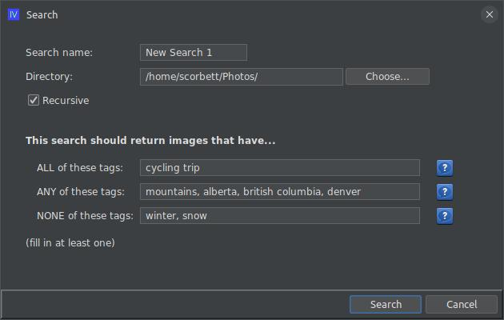

Here we can select where we want to search, and what tags we're looking for (or NOT looking for). We have
three ways to specify tags:

- ALL: these tags MUST be present for an image to be considered a match. In the screenshot above, we are only considering cycling trip photos.
- ANY: at least ONE of the tags in this list must be present. 
- NONE: here we can exclude images if they contain any tag in this list. In the example above, we don't want to see shots taken in winter.

When we execute this search, we are taken to the Image sets tab to view the results in a newly-created image set:

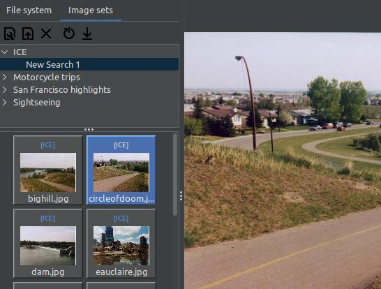

We notice that a new transient image set has been created under the "ICE" image set. It is named "New Search 1" unless
we chose a different name on the search dialog above. Because search results generate a transient image set by default,
it means that this search result will be lost when we close the application. If we like the results, we can 
edit the image set and select "save this image set on shutdown" as highlighted here:

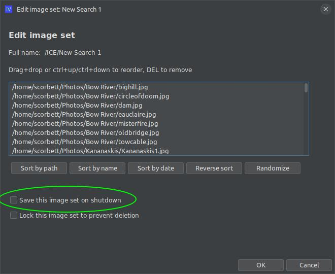

We can also use the "rename/move image set" option to give it a better name and to move it out of the ICE container:

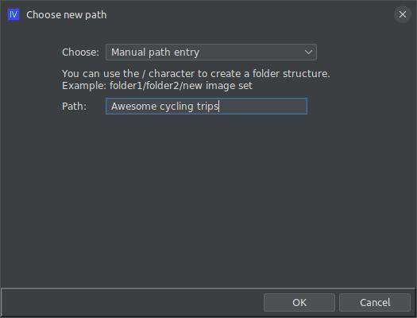

And now we see our search results have been saved in an image set with a better name:

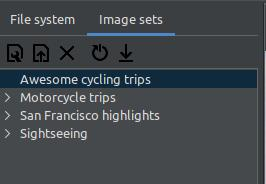

And now that our search results are in a proper image set, we of course have all the usual editing options for
image set handling as provided by the base ImageViewer application: we can add/remove images, add sub-sets,
and even execute searches within the set!

## How do I get it?

### Option 1: automatic download and installation

**NEW!** As of ImageViewer 2.3, you no longer need to manually build and install application extensions!
Now, you can visit the extension manager dialog and go to the "Available" tab:

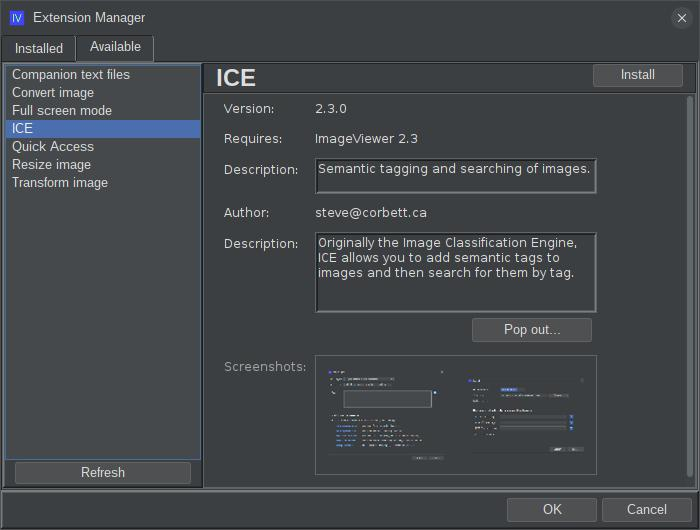

Select "ICE" in the left menu, and then hit the "Install" button in the top right. If you decide later to
remove the extension, revisit the extension manager dialog, select "ICE" in the left menu, and hit the
"Uninstall" button in the top right. The application will prompt to restart. It's just that easy!

### Option 2: Manual download

You can manually download the extension jar:
[ext-iv-ice-3.3.0.jar](https://www.corbett.ca/apps/ImageViewer/extensions/3.2/ext-iv-ice-3.3.0.jar)

Save it to your ~/.ImageViewer/extensions directory and restart the application.

### Option 3: build from source

You can clone this repo and build the extension jar with Maven (Java 17 or higher required).

```shell
git clone https://github.com/scorbo2/ext-iv-ice.git
cd ext-iv-ice

# Note: you must have run `mvn install` in the main ImageViewer repo first, as that is a dependency for this code.
mvn package

# Copy the result to the extensions directory:
cd target
cp ext-iv-ice-3.3.0.jar ~/.ImageViewer/extensions
```

## More information

- Project GitHub page: [ext-iv-ice](https://github.com/scorbo2/ext-iv-ice)
- Issues page: [ext-iv-ice issues](https://github.com/scorbo2/ext-iv-ice/issues)

## License

ImageViewer and the ICE extension are made available under the MIT license: https://opensource.org/license/mit

## Revision history

[Release notes](src/main/resources/ca/corbett/imageviewer/extensions/ice/ReleaseNotes.txt)
