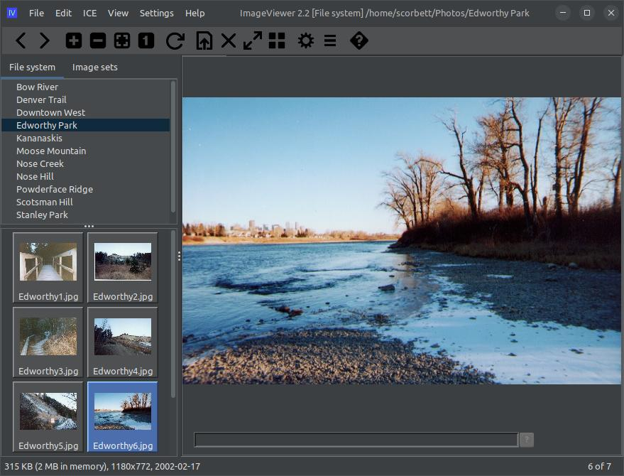

# ext-iv-ice

## What is this?
This is an extension for the ImageViewer application to allow semantic tagging or images, and searches
based on those tags. Originally a standalone application called ICE (Image Classification Engine) from 2012, this
extension duplicates some of the functionality of the original application in the form of an extension
for ImageViewer.

## How does it work?
When the ICE extension is first installed, the ImageViewer interface at first glance looks pretty much the
same as it did before:



But there are actually quite a few additional features now available in the application! Let's take a look.

### Tagging a single image

The first thing we can do is hit Ctrl+G to bring up the tag edit dialog for the currently selected image:


This allows us to enter "tags", or very short text descriptions, that can describe or label the contents of
this image. For example, we could enter information about when and where the photo was taken, who is in it,
what scenery is present, what the weather was like, or whatever else we like. Tags are entered as a comma-separated
list and you can be as generic or as specific as you like:


When we hit enter or click the "Save" button on the tag edit dialog, we will notice that a read-only summary
of the tags we entered is displayed at the bottom of the main image panel:


We can hit Ctrl+G again to bring the dialog back up and make any changes.

Tagging images is a tedious and time-consuming process, but it will be worth it later! And, as it turns out,
there's a way to speed up the process considerably...

### Tagging multiple images at once

In the ICE menu, we will find the "Tag images" menu entry:


Selecting this will bring up the "Tag images" dialog:


Here, we can apply tags to an entire directory of photos at a time, with optional recursion for subdirectories.
If there are tags that a set of photos all have in common (for example, location, or the date they were taken),
you don't need to tag each image individually. 

On this dialog we also have the option of using "special" tags that will be substituted with some value 
dynamically. This can be very useful! For example, if directory that contains the photos to be tagged is named
after the location where the photos were taken, then we can use the special tag `$(imageDirName)`, and this
will be replaced with the directory name.

For our example, every photo in this directory was taken in Edworthy Park, and in fact, the directory that
contains them is named Edworthy Park, so we can make use of this tag:


When we hit the "Apply" button, the tags we've entered here are applied to all images in the current directory
(with optional recursion into subdirectories if selected). Our special tag `$(imageDirName)` is automatically
replaced with the name of the containing directory. When we're finished, we can pick any image in this directory
and press Ctrl+G to view the tags that were applied to it:


### Searching for images

Okay, so you've gone through your photos and tagged each one with painstaking detail. Now what? Now we can
visit the search dialog!


Here we can select where we want to search, and what tags we're looking for (or NOT looking for). We have
three ways to specify tags:

- ALL: these tags MUST be present for an image to be considered a match. In the screenshot above, we are only considering cycling trip photos.
- ANY: at least ONE of the tags in this list must be present. 
- NONE: here we can exclude images if they contain any tag in this list. In the example above, we don't want to see shots taken in winter.

When we execute this search, we are taken to the Image sets tab to view the results in a newly-created image set:


We notice that a new transient image set has been created under the "ICE" image set. It is named "New Search 1" unless
we chose a different name on the search dialog above. Because search results generate a transient image set by default,
it means that this search result will be lost when we close the application. If we like the results, we can 
edit the image set and select "save this image set on shutdown" as highlighted here:


We can also use the "rename/move image set" option to give it a better name and to move it out of the ICE container:


And now we see our search results have been saved in an image set with a better name:


And now that our search results are in a proper image set, we of course have all the usual editing options for
image set handling as provided by the base ImageViewer application: we can add/remove images, add sub-sets,
and even execute searches within the set!

## Setup and requirements

To run the ICE extension, you'll need [ImageViewer](https://github.com/scorbo2/imageviewer) version 2.2, which
is the latest version at the time of this writing.

You'll need to clone the maven repo and build the extension jar, and copy it into your application extensions
directory:

```shell
git clone https://github.com/scorbo2/ext-iv-ice.git
cd ext-iv-ice
mvn package
cd target
cp ext-iv-ice-2.2.0.jar ~/.ImageViewer/extensions
```

To remove the extension, exit ImageViewer and delete the extension jar file. 

(Coming soon: automatic install/uninstall from within the application... much easier!)

## License

ImageViewer and the ICE extension are made available under the MIT license: https://opensource.org/license/mit
